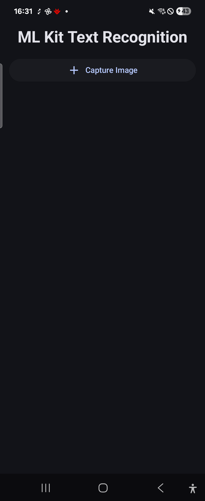
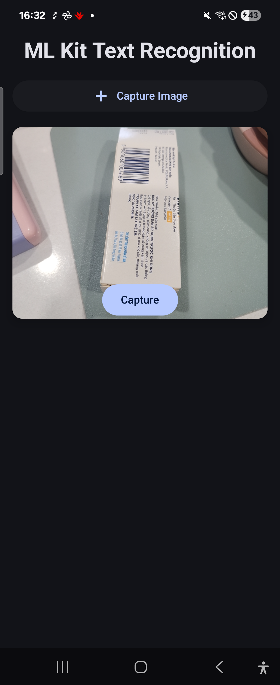
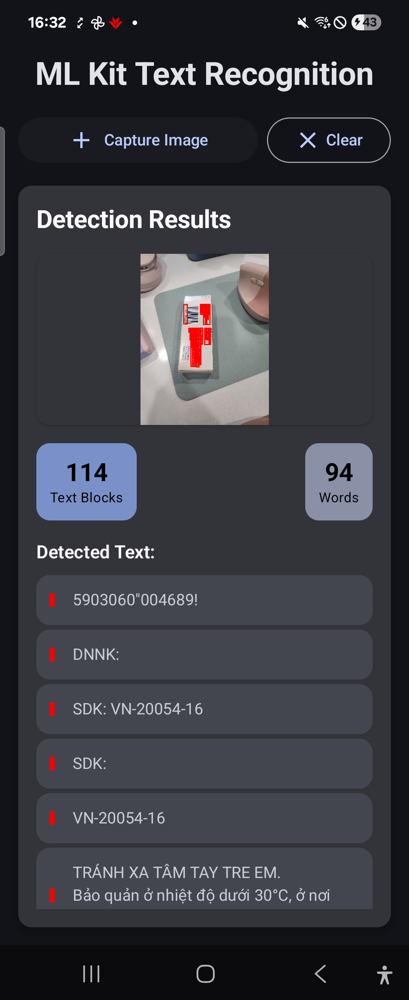
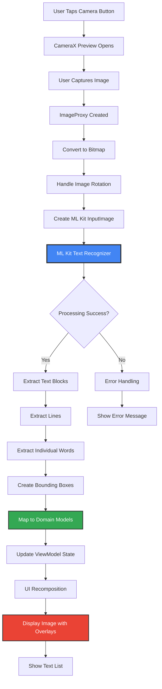
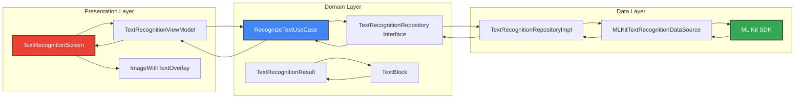
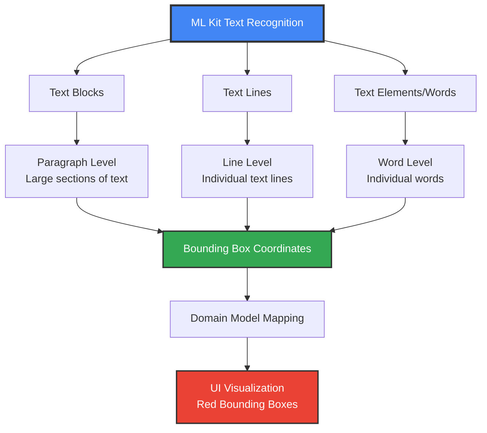

# Android Text Recognition App

A modern Android application that uses [Google's ML Kit Text Recognition v2 API](https://developers.google.com/ml-kit/vision/text-recognition/v2/android) to detect and extract text from images captured via camera. Built with Jetpack Compose, Clean Architecture, and modern Android development practices.

## 🚀 Features

- **Real-time Text Recognition**: Capture images and extract text using ML Kit
- **Multiple Text Detection**: Detects individual words, lines, and text blocks
- **Visual Bounding Boxes**: Red outlined boxes show detected text regions on images
- **Clean Architecture**: Separates data, domain, and presentation layers
- **Modern UI**: Material 3 design with Jetpack Compose
- **Edge-to-Edge Support**: Optimized for Android 15
- **Permission Handling**: Runtime camera permission management
- **Statistics Display**: Shows text blocks count and word count

## 📱 Screenshots

### Step-by-Step Usage

| Step 1: Camera Capture | Step 2: Text Processing | Step 3: Results Display |
|------------------------|-------------------------|-------------------------|
|  |  |  |
| Capture image with camera | Processing image with ML Kit | View detected text with bounding boxes |

The app displays captured images with red bounding boxes around detected text, providing visual feedback for each detected text region.

## 🏗️ Architecture

This project follows **Clean Architecture** principles with three main layers:

### Domain Layer
- `TextRecognitionResult` - Data models for recognition results
- `TextBlock` - Individual text blocks with bounding boxes
- `TextRecognitionRepository` - Repository interface
- `RecognizeTextUseCase` - Business logic for text recognition

### Data Layer
- `TextRecognitionRepositoryImpl` - Repository implementation
- `MLKitTextRecognitionDataSource` - ML Kit integration

### Presentation Layer
- `TextRecognitionScreen` - Main UI screen
- `TextRecognitionViewModel` - UI state management
- `ImageWithTextOverlay` - Component for image with bounding boxes
- `CameraPreview` - Camera functionality component

## 🛠️ Tech Stack

- **UI Framework**: Jetpack Compose with Material 3
- **Architecture**: Clean Architecture + MVVM
- **Dependency Injection**: Hilt
- **Text Recognition**: Google ML Kit Text Recognition API
- **Camera**: CameraX
- **Async Operations**: Kotlin Coroutines + StateFlow
- **Navigation**: Navigation Compose
- **Permissions**: Accompanist Permissions

## 📋 Requirements

- **Android Studio**: Arctic Fox or newer
- **Min SDK**: 24 (Android 7.0)
- **Target SDK**: 35 (Android 15)
- **Kotlin**: 2.0.21+

## 🚀 Getting Started

### Prerequisites

1. Android Studio with latest SDK tools
2. Android device or emulator with camera support
3. Internet connection for ML Kit model download (first run)

### Installation

1. **Clone the repository**
   ```bash
   git clone <repository-url>
   cd android-text-recognition
   ```

2. **Open in Android Studio**
   - Open Android Studio
   - Select "Open an existing project"
   - Navigate to the project directory

3. **Sync Gradle**
   - Android Studio will automatically prompt to sync
   - Wait for dependency download and indexing

4. **Run the app**
   - Connect an Android device or start an emulator
   - Click "Run" or press `Ctrl+R` (Windows/Linux) / `Cmd+R` (Mac)

## 📖 Usage

Follow these steps to use the text recognition features:

1. **Grant Permissions**: Allow camera access when prompted
2. **Capture Image** (Step 1): Tap "Capture Image" to open camera preview - see `step-01.png`
3. **Take Photo**: Use the capture button in camera preview
4. **Processing** (Step 2): Wait for ML Kit to process the image - see `step-02.png`
5. **View Results** (Step 3): See the image with red bounding boxes around detected text - see `step-03.png`
6. **Browse Text**: Scroll through the list of detected text blocks with statistics
7. **Clear Results**: Use "Clear" button to reset and capture new images

### Visual Guide

Refer to the step-by-step screenshots above for a complete visual walkthrough of the app's functionality.

## 🔧 Dependencies

### Core Android
```kotlin
androidx.core:core-ktx:1.16.0
androidx.lifecycle:lifecycle-runtime-ktx:2.9.1
androidx.activity:activity-compose:1.10.1
```

### Compose
```kotlin
androidx.compose:compose-bom:2024.09.00
androidx.compose.ui:ui
androidx.compose.material3:material3
androidx.navigation:navigation-compose:2.8.5
```

### ML Kit & Camera
```kotlin
com.google.mlkit:text-recognition:16.0.0
androidx.camera:camera-core:1.3.4
androidx.camera:camera-camera2:1.3.4
```

### Dependency Injection
```kotlin
com.google.dagger:hilt-android:2.51
androidx.hilt:hilt-navigation-compose:1.2.0
```

## 🏛️ Project Structure

```
app/src/main/java/com/example/android_text_recognition/
├── data/
│   ├── datasource/local/
│   │   └── MLKitTextRecognitionDataSource.kt
│   └── repository/
│       └── TextRecognitionRepositoryImpl.kt
├── di/
│   └── AppModule.kt
├── domain/
│   ├── model/
│   │   └── TextRecognitionResult.kt
│   ├── repository/
│   │   └── TextRecognitionRepository.kt
│   └── usecase/
│       └── RecognizeTextUseCase.kt
├── presentation/
│   ├── component/
│   │   ├── CameraPreview.kt
│   │   └── ImageWithTextOverlay.kt
│   ├── navigation/
│   │   └── Navigation.kt
│   ├── screen/
│   │   └── TextRecognitionScreen.kt
│   └── viewmodel/
│       └── TextRecognitionViewModel.kt
├── ui/theme/
├── MainActivity.kt
└── TextRecognitionApplication.kt
```

## 🔍 How It Works

### Text Recognition Architecture Flow



### Clean Architecture Data Flow



### Text Recognition Process Details

1. **Image Capture**: CameraX captures image as `ImageProxy`
2. **Image Processing**: Convert to `Bitmap` with proper rotation handling
3. **ML Kit Processing**: 
   - Convert `Bitmap` to ML Kit `InputImage`
   - Process with `TextRecognizer`
   - Extract text blocks, lines, and individual words
4. **Result Processing**: Map ML Kit results to domain models
5. **UI Display**: Show image with red bounding boxes and text list

### Multi-Level Text Detection



The app detects text at three granularity levels:
- **Text Blocks**: Paragraphs or sections
- **Lines**: Individual lines of text  
- **Elements**: Individual words

This provides comprehensive text detection similar to professional OCR tools.

## 🎨 UI Components

### ImageWithTextOverlay
Displays captured images with red bounding boxes drawn over detected text regions using Canvas composable.

### CameraPreview
Integrates CameraX with Compose using `AndroidView` for seamless camera functionality.

### TextRecognitionScreen
Main screen coordinating camera capture, text recognition, and results display.

## 🔒 Permissions

The app requires the following permission:
- `CAMERA`: For capturing images to process

Permission is requested at runtime using Accompanist Permissions library.

## 🚨 Troubleshooting

### Common Issues

1. **ML Kit Model Download**
   - First run requires internet connection
   - Model downloads automatically (~10MB)

2. **Camera Permission Denied**
   - Grant permission in app settings
   - Restart the app

3. **Text Recognition Accuracy**
   - Ensure good lighting
   - Hold camera steady
   - Text should be clearly visible

4. **Performance Issues**
   - Close other camera apps
   - Restart device if camera is unresponsive

## 🙏 Acknowledgments

- [Google ML Kit Text Recognition v2](https://developers.google.com/ml-kit/vision/text-recognition/v2/android) for text recognition capabilities
- [Android Jetpack](https://developer.android.com/jetpack) for modern Android development tools
- [Material Design 3](https://m3.material.io/) for UI design guidelines

**Built with ❤️ using modern Android development practices**
